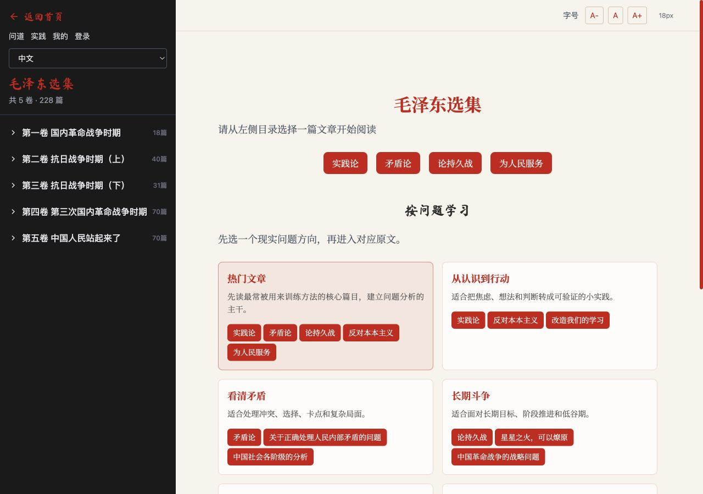
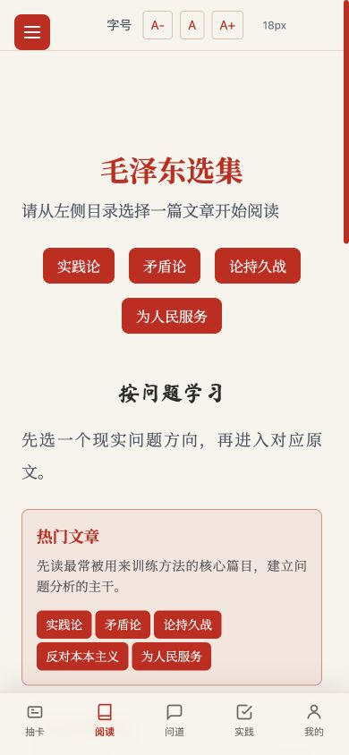
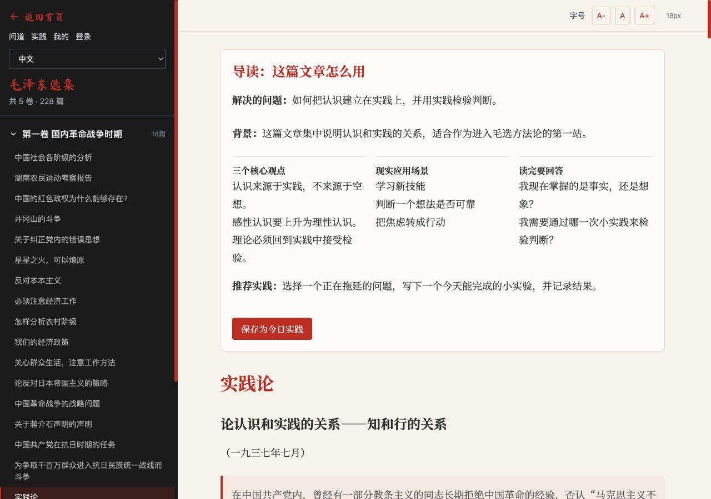
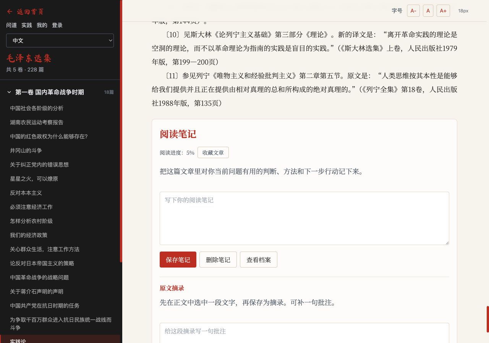
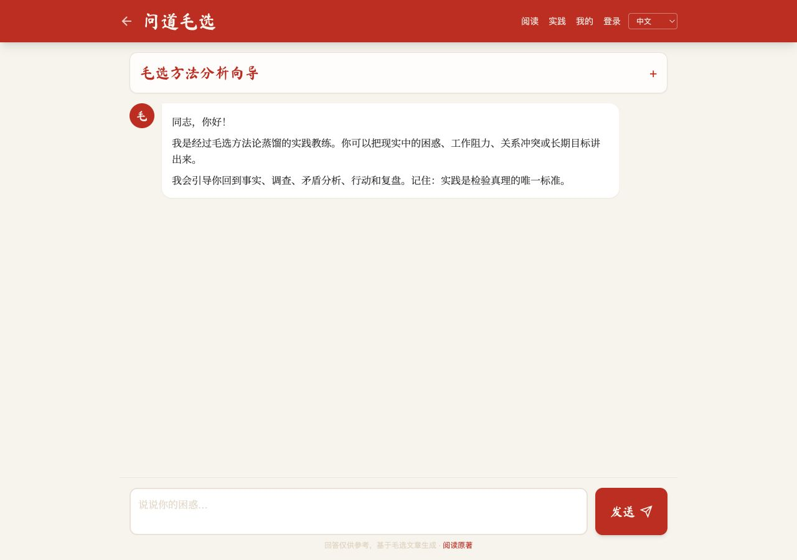
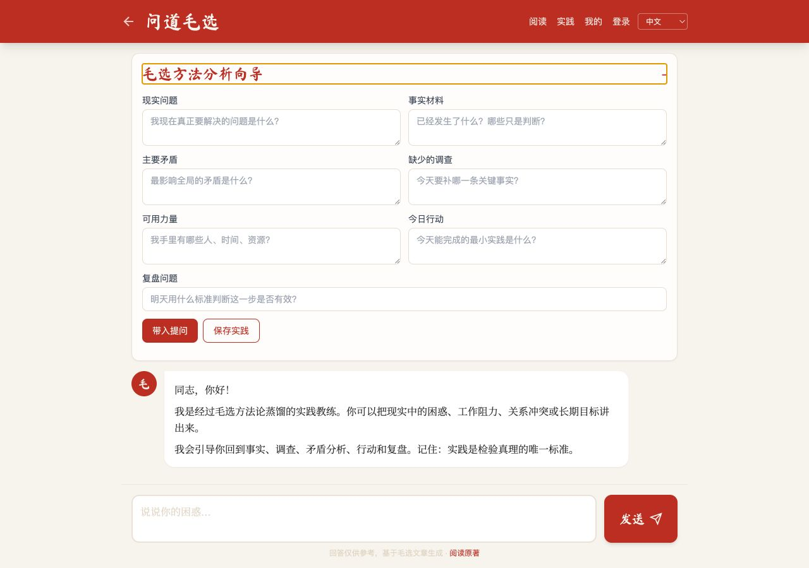
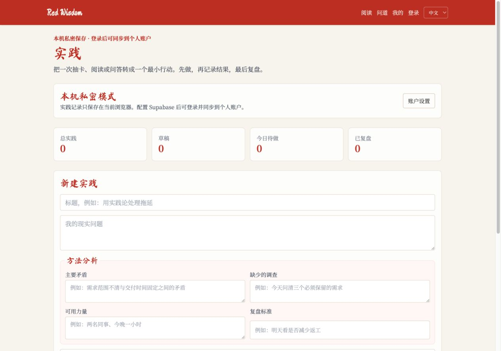
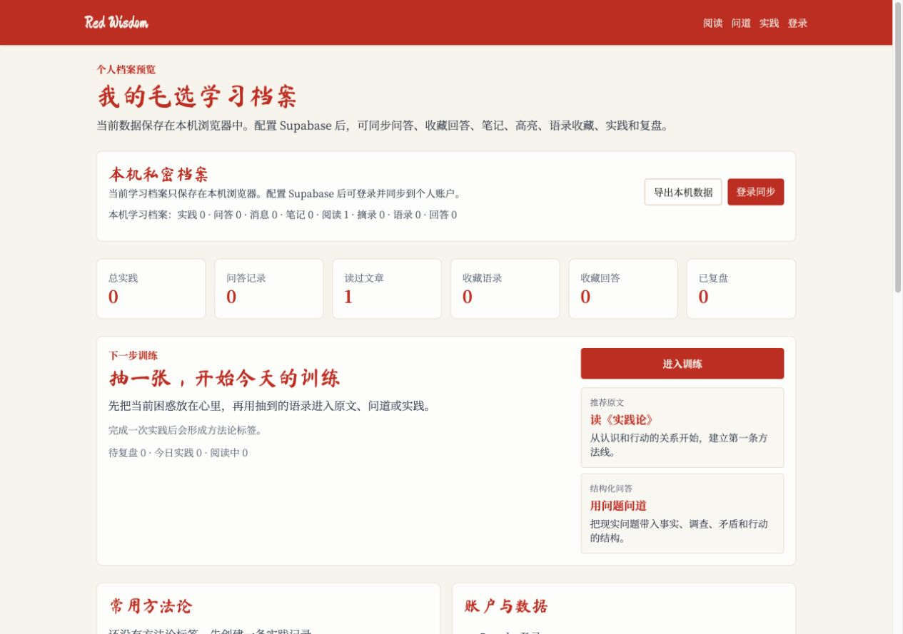
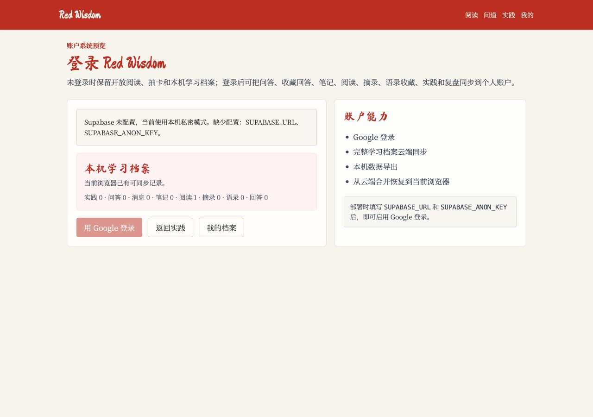

# Red Wisdom 产品审计

审计日期：2026-07-13

## 审计范围

本次审计对照以下目标检查当前项目：

- 用简洁的毛主席语录卡片缓解焦虑并吸引第一次访问。
- 提供可信、可追溯的《毛泽东选集》阅读体验，并支持笔记、书签、摘录和 AI 解惑。
- 让 AI 通过毛选方法逐步引导用户分析现实问题，而不是扮演毛主席或直接给结论。
- 把毛主席与中国共产党历史中的真实实践经验，转化为有边界、有出处的历史类比和行动方法。
- 登录后形成可持续积累的个人问题、阅读、行动和复盘档案。
- 移动端成为完整主体验，未来可扩展多语言。

检查方式：代码与需求文档审阅、桌面端 1280x900 浏览器体验、移动端 390x844 浏览器体验、现有自动化测试。

## 总体结论

当前项目已经是一个功能较完整的原型，但还不是“毛选版本的 BibleChat”。

已经成立的部分是：卡片引流、问题导向阅读、原文导读、本机笔记与书签、结构化分析表单、实践记录、个人档案和账户骨架。尚未成立的核心是：以“用户正在解决的现实问题”为主线，把历史案例、原文证据、AI 追问、行动和复盘串成一个持续案例。

因此，下一阶段不应继续横向增加独立功能页，而应建立统一的“问题案例”数据对象，并补齐可信内容层和历史案例检索层。

## 核心流程审计

### 1. 语录卡引流

健康度：良好。


优点：

- 卡面已恢复为语录、出处和时间，视觉完整，没有内部滚动条。
- 移动端卡片尺寸稳定，没有横向溢出，底部导航清楚。
- 首页只保留抽卡主体验，符合低门槛引流定位。

主要问题：

- 翻到正面后没有形成下一步。代码已经生成 `articleHref`，但卡片界面没有使用它。
- “治愈你90%的焦虑”是难以证明的效果承诺，也会弱化产品“回到事实和行动”的可信定位。
- 卡片是可点击的 `div`，没有按钮语义、键盘操作和焦点状态。

建议：卡面继续保持不加按钮；翻牌后在卡片下方出现两个轻量动作：“读这句话的出处”和“带着当前问题去问道”。

### 2. 阅读发现

健康度：良好，但内容可信度基础不足。





优点：

- 同时支持按卷和按现实问题进入原文。
- 热门文章、认识到行动、矛盾、长期目标、组织协作、调查研究等路径已经能帮助初学者选择。
- 字号控制和移动端底部导航已经可用。

主要问题：

- 页面写“228篇”，但 `catalog.json` 实际有 229 条，五卷计数为 18、40、31、70、70。
- 目录只有标题和文件名，没有整套文本的版本、出版社、版次、来源、校对状态或授权说明，因此当前不能用产品文案证明“正版”。
- 229 篇原文中，只有约 10 篇具备结构化导读；AI 可检索的也主要是这些导读和语录。
- 没有文章搜索、主题筛选、人物/事件入口，历史经验难以被发现。
- 移动端菜单按钮没有可访问名称；桌面目录使用带 `onclick` 的 `div`，键盘用户无法正常操作。

建议：先把“正版”改造成可验证的“权威版本层”，为每篇文章保存版本、页码、段落锚点、来源和校对状态；未完成前只称“全文阅读”。

### 3. 原文、导读、笔记和书签

健康度：基础能力可用，阅读闭环较弱。





优点：

- 核心文章的导读能回答“这篇文章怎么用”，并能保存为实践。
- 笔记、收藏文章、阅读进度和原文摘录已能保存在本机档案。
- 字号可调，正文排版在桌面端较舒适。

主要问题：

- 笔记、收藏和摘录入口位于整篇长文末尾；用户阅读中途几乎发现不了。
- 每篇文章目前只有一条整篇笔记，不支持多个段落笔记、标签、AI 解释记录或笔记与现实问题的关联。
- 摘录只保存文本，不是稳定的段落锚点；原文变化后无法精确回到出处。
- 阅读进度记录为百分比，但还没有围绕一个学习问题形成阅读计划和阶段结果。

建议：增加不遮挡正文的阅读工具条或底部抽屉，包含书签、笔记、选中解释和“关联到我的问题”；笔记必须保存文章、段落锚点、版本和问题案例 ID。

### 4. AI 咨询与方法训练

健康度：方法论原型可用，离“蒸馏后的毛选 AI”仍有明显距离。






优点：

- 系统提示明确要求事实、调查、矛盾、行动和复盘，并禁止神谕化和替用户做重大决定。
- 已有保存回答、生成实践、本机问答历史和安全提示。
- 移动端输入区没有被底部导航遮挡。

主要问题：

- 当前“蒸馏”实质是 DeepSeek 基础模型加一个系统提示和轻量关键词检索，并不是独立训练、可版本化的 skills 系统。
- 检索候选只来自 181 条语录和约 10 篇可用导读，不检索 229 篇完整原文段落。
- 检索是关键词包含和固定标签打分，最多返回 4 条、1500 字上下文；没有语义检索、重排、段落锚点、版本页码或引用核验。
- 回答被要求一次性输出七段固定结构，更像生成报告，而不是逐步追问用户、帮助其形成判断。
- 七个输入框的“分析向导”把高认知负担放在对话前，初次用户往往并不知道主要矛盾或缺少什么调查。
- 当前没有历史案例库、事件检索、历史类比、适用边界和反类比机制。

建议：把 AI 改为两种模式：“直接解惑”和“逐步分析”。逐步分析每轮只问一个关键问题，通常先完成事实与目标澄清，再决定是否进入历史类比和行动方案。

### 5. 实践与复盘

健康度：数据结构较完整，体验仍像表单管理器。



优点：主要矛盾、调查、可用力量、行动和复盘标准都已进入实践记录，且现有测试覆盖了保存、状态和复盘提示。

主要问题：

- 实践页和问道页分析向导重复输入相同字段。
- 阅读、问答和实践还没有落到同一个“现实问题案例”中，用户会看到多条记录，却难以回顾一件事的完整发展。
- 缺少事件时间线、证据变化、AI 原判断与实际结果对照，也就无法真正训练判断质量。

建议：实践不再作为一级孤立对象，而作为“问题案例”中的一个行动周期。一个案例可以包含多轮调查、阅读、历史类比、行动和复盘。

### 6. 账户与个人档案

健康度：本机档案可用，真实账户尚未上线。





优点：本机档案、导出、云端数据映射、RLS schema 和恢复合并逻辑已经具备较完整骨架。

主要问题：

- `SUPABASE_URL` 和 `SUPABASE_ANON_KEY` 为空，Google 登录按钮实际禁用。
- 登录后并没有自动切换成新的产品模式；当前仍是同一组页面加手动“同步到云端/从云端恢复”。
- 游客也会在本机保存问答、笔记和实践，这与需求文档中“游客临时问答不保存”存在冲突。
- 缺少自动同步状态、冲突可见性、账号删除和敏感咨询数据的细粒度隐私控制。

建议：保留游客本机模式，但明确称为“本机临时档案”；登录后自动迁移并持续同步，首页默认进入“继续我的问题”，同时仍保留抽卡入口。

## “毛选版 BibleChat”应借鉴什么

BibleChat 官方产品把经典文本阅读、按问题找经文、上下文解释、个人日记和持续学习计划放在同一体验中。值得借鉴的不是宗教化语气，而是它的产品闭环：用户从当下情绪或问题进入，得到可核对的原文，再进入持续记录与日常计划。

Red Wisdom 更适合形成自己的闭环：

> 当前困难 → 澄清事实 → 匹配历史案例 → 阅读原文证据 → 提炼可迁移方法 → 采取最小行动 → 记录结果 → 修正判断

不要照搬祈祷、神谕或单纯连续签到。更适合的长期指标是“完成了多少次调查、实践和复盘，以及判断是否被结果修正”。

参考：

- [BibleChat 官方功能页](https://thebiblechat.com/)
- [BibleChat App Store 产品说明](https://apps.apple.com/us/app/bible-chat-daily-devotional/id6448849666)

## 历史类比能力设计

这是下一阶段最有差异化的能力，但必须基于结构化史料，不能仅靠模型自由联想。

每个历史案例至少包含：

```text
case_id
事件名称与时间范围
当时要解决的问题
初始条件与限制
主要矛盾及其变化
做过哪些调查
可依靠力量与阻力
策略、阶段和关键行动
结果与代价
哪些条件可迁移到今天
哪些条件不可类比
对应毛选原文段落
党史/权威史料来源
编审状态与置信度
```

AI 使用历史案例时应固定输出：

1. 为什么这个案例与用户问题相似。
2. 哪些关键条件不同，不能机械套用。
3. 当时如何调查、判断主要矛盾和组织力量。
4. 对应的原文与史料出处。
5. 可迁移的方法，而不是照搬历史结论。
6. 用户今天可以验证的最小行动。

首批案例建议只做 20 到 30 个高质量案例，覆盖调查研究、弱小团队生存、路线纠偏、统一战线、根据地建设、组织协作、资源约束、长期战略和危机转折。每个案例经过人工编审后再进入 AI 检索。

## 建议的核心数据模型

新增 `problem_cases` 作为登录态核心对象：

```text
problem_case
  基本问题与目标
  事实/判断/情绪
  主要矛盾版本历史
  调查任务与新证据
  相关历史案例
  相关原文段落
  AI 对话
  行动周期
  结果与复盘
  方法论能力变化
```

阅读笔记、问答、收藏和实践都关联 `problem_case_id`。这样“我的”页面展示的不是八类分散记录，而是“我正在解决的三件事”和每件事的进展。

## 优先级路线

### P0：建立可信核心闭环

1. 统一“问题案例”对象，合并问答、阅读、行动和复盘主线。
2. 为全部原文增加版本、来源、页码/段落锚点和校对状态，修复 228/229 计数不一致。
3. 建立全文分段检索、引用深链和引用核验，不再只检索语录与少量导读。
4. 建立首批人工编审历史案例库，并明确可类比与不可类比条件。
5. 把毛选方法做成可版本化的 `mao-method-v1` skill：事实、调查、矛盾、力量、阶段、行动、复盘。
6. 建立问题集评测，检查引用准确、追问质量、历史类比边界、行动可执行性和高风险安全。

### P1：打通用户体验

1. 卡片翻牌后增加卡外“读出处”和“带着问题问道”。
2. AI 增加逐步分析模式，先追问再分析；把七字段表单降为高级模式。
3. 阅读页增加常驻但轻量的书签/笔记/选中解释入口。
4. 登录后默认显示“继续我的问题”，自动同步本机档案。
5. 档案页按问题案例组织，展示事实变化、行动、结果和复盘时间线。

### P2：完善产品与扩展

1. 配置并端到端验证 Google 登录、自动同步、冲突处理、删除账号和隐私设置。
2. 增加全文搜索、人物、事件、时间线和主题索引。
3. 修复卡片、目录和菜单的键盘及屏幕阅读器可用性。
4. 中文核心内容稳定后，再扩展英文界面、术语表、中英对照和多语言 AI。

## 验收指标

下一版本不应只用页面数量验收，建议至少跟踪：

- 抽卡后进入出处或问道的比例。
- 从问题进入原文并保存一条笔记的比例。
- AI 回答中可点击、可核验引用的覆盖率和准确率。
- AI 在信息不足时先追问而非直接下结论的比例。
- 历史类比中同时说明相似点和差异点的比例。
- 用户创建行动后完成复盘的比例。
- 同一问题完成两轮“行动—结果—修正”的比例。

## 证据限制

- 本地 Supabase 未配置，因此没有验证真实 Google OAuth、跨设备同步和账号删除。
- 本地静态服务器无法运行 Vercel `/api/chat`，且未使用用户 API Key，因此没有实际评价模型回答质量、流式错误恢复和线上配额。
- 可访问性结论来自 DOM、键盘语义和截图风险检查，不代表完整 WCAG 合规审计。
- 现有 84 项自动化测试全部通过，但主要覆盖数据逻辑和静态结构，尚未覆盖真实登录、全文检索、AI 引用质量和历史类比质量。
